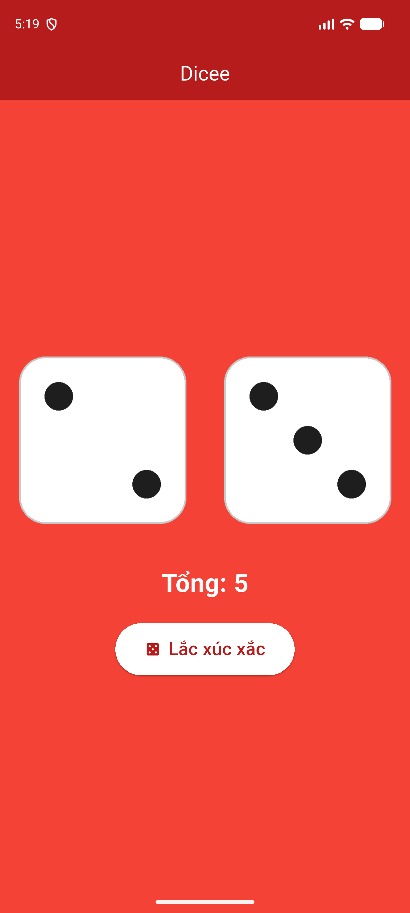

# Lab 3: Dicee

Mô phỏng lắc hai viên xúc xắc.

## Chức năng

- Nhấn vào xúc xắc hoặc nút **Lắc xúc xắc** để tạo số ngẫu nhiên 1–6 bằng `dart:math`.
- `StatefulWidget` + `setState()` để đổi hình `assets/images/dice1..6.png`.
- Hiển thị tổng điểm hai viên.

## Cấu trúc chính

- `lib/main.dart`
- `assets/images/`

## Chạy ứng dụng

```bash
flutter pub get
flutter run
```

## Demo


